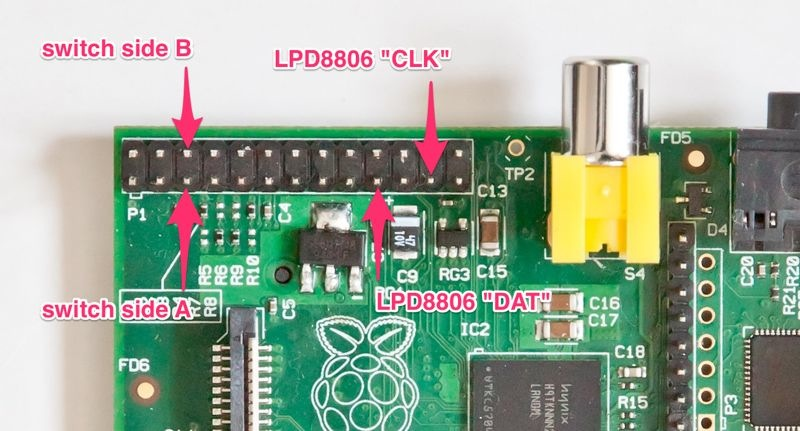

# ambi-tv

A software framework to build an Ambilight clone based on an embedded Linux board (like Raspberry Pi), a video capture device and an RGB LED strip.

A [demo video](http://www.youtube.com/watch?v=8cpQpGYtjR0) is available. It includes pictures of my hardware setup.

ambi-tv is based on the idea of using an HDMI splitter and an HDMI-to-Composite converter to tap into the image data displayed on your screen and processes it to drive the LEDs. This way, it works with any video source that you can connect to your screen, lifting the limitation of other systems that require the content to be displayed by a dedicated computer.

The ambi-tv software is designed in a way to be easily extensible and customizable.

A standalone ambi-tv device is extremely easy to build using a readily-available Raspberry Pi board.

## Hardware Setup

ambi-tv only accesses hardware features through abstract kernel interfaces, so it should (in theory) work on any embedded Linux board that supports the necessary hardware features. However, since my own installation uses a Raspberry Pi, this will be the particular setup to be documented.

You will need the following hardware:

- Raspberry Pi (either version A or B)
- [HDMI 1 input to 2 outputs splitter](http://www.amazon.com/Sewell-Powered-Splitter-Certified-Up-1080p/dp/B003B4O7NS/ref=sr_1_4?ie=UTF8&qid=1374325014&sr=8-4): Any splitter will do, but I recommend one with an external power supply, since those are still very cheap and provide a much better picture on your screen.
- [HDMI-to-Composite adapter](http://www.amazon.com/Etekcity®-Composite-Video-Audio-Converter/dp/B008FO7PQA/ref=sr_1_3?ie=UTF8&qid=1374325139&sr=8-3): I use the one linked, which works well for me.
- [LPD8806 RGB LED strip](http://www.adafruit.com/products/306): The length obviously depends on the size of your screen.
- [USB video grabber](http://www.amazon.com/EasyCAP-DC60-Creator-Capture-High-quality/dp/B002H3BSCM/ref=sr_1_11?ie=UTF8&qid=1374326275&sr=8-11): Get a cheap one, but be sure that it works under Linux on the Raspberry Pi – Look at the very bottom of this documentation for a recap of how I got this working ("it's complicated...").
- 5V power adapter: Should provide enough current to drive the Raspberry Pi and the RGB strip. I'd recommend one rated for 4A or more.
- A push switch: Optional, but it can be used to control ambi-tv without needing to go the Linux console.
- Some cables, soldering tools, etc… Nothing particularly fancy.

Assembling the hardware is easy, here's what I did:

- Cut up a mini-USB cable. This will be used to power the Raspberry Pi.
- Solder a plug that fits your 5V adapter to the leds of the cut-up mini-USB cable: The positive lead in the USB cable has a red insulation, GND has a black insulation.
- Solder two additional leads to the positive and ground leads: These will be used to power the RGB strip.
- The LPD8806 strip has 4 leads – Find a suitable connector for them (I just use a piece of header) and solder it to the power leads (check the silkscreen on the RGB strip to find the correct leads).
- Solder two more leads to the strip connector. These should go to the pins labeled DAT and CLK.
- Take another piece of female 2.54mm header with 3 pins and solder the DAT and CLK leads to the outer two pins, leaving the middle one unconnected.
- Optional: Take one more piece of female 2.54mm header and solder your push switch to it.

Now connect the mini-USB power plug to the Raspberry Pi, then connect the extra headers as follows:

    Raspberry Pi          Header
    ---------------------------------
    P1/19 (MOSI)          LPD8806 DAT pin
    P1/23 (SCLK)          LPD8806 CLK pin
    P1/5                  Push switch side A
    P1/6                  Push switch side B

Here is an illustration:

Next, disconnect your main HDMI cable from your TV (the main cable should be the one coming from your A/V receiver. If you have multiple HDMI devices connected to your screen, I'd recommend buying an HDMI switch, so that you won't need to switch around any cables to use ambi-tv with all your devices).

Plug the main HDMI cable into the input of your HDMI splitter. Connect the screen to one output of the HDMI splitter, then connect the HDMI-to-Composite adapter to the other end. Connect the USB video grabber to the HDMI-to-Composite adapter and plug the grabber into the Raspberry Pi.

I used a strong double-sided adhesive tape to affix the RGB strip along the edges of my TV screen.

Finally, connect the power plug to the 5V adapter to power up the Raspberry Pi and RGB strip.

## Software Installation

Clone the git repository on your Raspberry Pi and type `make` to build it. After the build process is finished, you will find the executable in `bin/ambi-tv`.

ambi-tv takes the following command line switches:

- `-b/--button-gpio [i]`: Use the i-th GPIO pin for the push button. If you connected the push button as described above, use `3` as argument here (`1` if you have an older, revA Raspberry Pi). The default is `-1`, meaning "Don't use the push button.".
- `-f/--file [path]`: The path to the configuration file to use (see below). The default is `/etc/ambi-tv.conf`.
- `-h,--help`: Prints the help text and exits.
- `-p,--program [i]`: ambi-tv will start the i-th program defined in the configuration file after start-up. The default is `0`, e.g. the first program.

While ambi-tv is running, you can use the `Space` key to cycle between different programs defined in the configuration file, or use the `t` key to toggle between `running` and `paused` states. In `paused` state, all components are deactivated.

If you have a push button connected and enabled via command line argument, you can use `single-click` to toggle between `running` and `paused` states, or use a `double-click` to cycle between programs (e.g. the push button behaves quite similarly to the earplugs remote on iOS devices).

The repository contains a sample configuration file `sample.conf` that you can use or customize.

Be sure that the `spidev` driver is loaded when you start ambi-tv: `modprobe spi-bcm2708`.

## Configuration File

ambi-tv uses a configuration file to customise available features and their settings. In the configuration file, you can create instances of ambi-tv **components** under an arbitrary name with an arbitrary set of options, as well as **programs**, which tie multiple components together.

A component is a part of ambi-tv's processing pipeline. It can either be a source (provides pixel data and timing), a processor (defines the behavior of an effect) or a sink (handles the interaction with the output LEDs). You can extend ambi-tv easily be making your own components. A component instantiation looks like this, and you can have multiple instantiations of the same component under different names with different settings:

    component_name {
        name            instance_name
        settingA        valueA
        settingB        valueB
    }

A program defines a set of component instances that should be active at the same time (typically one source, one processor and one sink instance). You can add as many programs as you like. A program definition looks like this (note the ampersand prefixes):

    &program_name {
        activate        instance_nameA
        activate        instance_nameB
        ...
    }

Have a look at the `sample.conf` to see how this works.

## Components

Currently, ambi-tv includes the following components with their respective settings:

**v4l2-grab-source**: A video grabber source that uses video4linux 2 mmap()-based capture.

- `video-device`: The path of the video device to use, like `/dev/video0`.
- `buffers`: The amount of buffers to request from the kernel. A value between 4 and 8 should be good.
- `crop-top`, `crop-bottom`, `crop-left`, `crop-right`: The amount of pixels to crop in the captured video stream. This is useful if your video stream doesn't fill the entire picture.
- `autocrop-luminance-threshold`: An 8-bit luminance threshold in capture colorspace. If specified, the component will automatically crop the input stream from the edges, until a line is found in which luminance values fall above the given threshold. This is useful if the stream either has an unpredictable letterbox (an artefact of some v4l drivers) or if you want to use ambi-tv with letterboxed movies and the such. Note that auto-cropping happens before manual cropping and is cumulative, e.g. if you use auto-cropping with manual cropping, the manual crops will be applied after the automatic crop. Apply a negative value to disable auto-cropping (the default).

**timer-source**: A source that provides only timing information, but no video stream.

- `millis`: The amount of milliseconds between timing events emitted by this source.

**avg-color-processor**: Calculates the average color of the entire video frame – This works nicely if the edge processor is too wild for you. It doesn't have any settings.

**edge-color-processor**: Calculates the colors around the edges of the video frame – This is the typical "ambilight" effect.

- `box-width`, `box-height`: Currently not used! The size (in pixels) of the box which the processor will use for each LED in the output: The LED will be set to the average color of that box. Smaller box sizes will yield a less fuzzy effect, but larger box sizes are less noisy and might (counter-intuitively) capture more "detail": Experiment with this to find a setting you like.

**mood-light-processor**: Doesn't require a video frame input and creates a nice "mood light" effect by mapping the HSL colorspace.

- `speed`: The step amount in the normalised H component of the HSL colorspace to apply per timing event. The overall perceived speed also depends on the frequency of source timing events, of course.

**lpd8806-spidev-sink**: An output sink that uses spidev to drive an LPD8806 RGB LED strip.

- `spi-device`: The path to the spidev device to use, like `/dev/spidev0.0`.
- `spi-speed-hz`: The frequency to drive the SPI bus with. The default is 2500000 (2.5MHz). You can lower this if you get odd behaviours due to line interference.
- `leds-top`, `leds-left`, `leds-bottom`, `leds-right`: Defines the LEDs on each side of the screen. The LPD8806 addresses LEDs as 0..x, where x is the amount of LEDs on the strip minus 1. You can either separate individual indexes with commas or use ranges with a -. You can also use an X to designate missing LEDs. As an example, "33-56" means "LEDs 33 to 56", "22-5" means "LEDs 22 to 5", and "13-0,4X,97-84" means "LEDs 13 to 0, then an empty space where there should be 4 LEDs, but there aren't any, and LEDs 97-56". I use the "empty LEDs" thing to designate a hole in the strip, e.g. where the foot of my TV is. This is necessary for coordinate calculations. The order of the LED addresses should be "left-to-right" for top and bottom, and "top-to-bottom" for left and right. Re-read this paragraph now, since this is a bit complicated. Also, be sure to test your settings with a test image in order to be sure you got everything right.
- `led-inset-top`, `led-inset-bottom`, `led-inset-left`, `led-inset-right`: Counteract the fact the LED strip on an edge is shorter or longer than the screen edge, given in percent. As value of '3.5' would mean that your LED strip on that edge is 3.5 percent shorter than the screen edge, a value of "-1.2" would mean that the LED strip is 1.2 percent wider than the screen edge. Use this if the LED output isn't properly aligned with what you see on the screen.
- `gamma-red`, `gamma-green`, `gamma-blue`: Specify the gamma table for individual color components: Since the LPD8806 uses a linear RGB colorspace, gamma correction is necessary for good results. Typically, you'll want the same gamma on every component, but you can experiment with different settings if you find you're seeing a bit of color imbalance. For me, values between 1.6 and 1.8 work well, but you can also try 2.2 or 2.8, which refer to the PAL and NTSC gamma values respectively.
- `blended-frames`: The amount of processor output frames to blend to actually determine the color of each LED. Use 0 or 1 to disable. The more frames you blend, the smoother the effect will appear, but it can also become "laggy" at a certain point. Values between 2 and 6 typically produce great results. Experiment with this, too, as larger values tend to look great with movies, whereas smaller values work great with video games.

## Extending ambi-tv

Due to the component-based architecture, ambi-tv can be extended quite easily by writing your own sources, processors and sinks. If you want to add your own color effects, have a look at `component.h`, as well as the existing components in the `src/components` directory.

The overall idea is that each component only needs to implement a certain set of functions, which are then exported via function pointers in a component structure. The configuration via the configuration file uses the `int argc, char** argv` mechanism you are probably very used to, so you can just use `getopt_long` with for it.

When you are done writing a component, you need to register it in `registrations.c` by adding it to the list there.

Once you re-compile ambi-tv, you can now instantiate your new component via the configuration file.

**Video Formats**

Supporting different video formats is also something you can do to the extend ambi-tv: To do so, have a look at `video-fmt.c` and add concrete implementations of the required functions for your new video format.

Right now, only YUYV (aka. YUV 4:2:2) is supported, because this is what my capture device uses.

## Choosing a USB video grabber

Finding a USB video grabber that works on the Raspberry Pi isn't that easy, unfortunately, but here's what I use, so you can just replicate this.

I bought a cheap video grabber branded "EasyCAP", because I read on the internet that it is based on STK1160 chipset, which is well-supported under Linux. However, it turned out that the one I bought contains a different chipset branded `fushicai usbtv`, which doesn't not have a driver in the mainline kernel yet :-/

However, I found that somebody is currently working on a driver in the `linux-next` tree. At the time of writing, the driver only supports the NTSC input format. When I tested the driver, I found that there were a lot of artefacts with NTSC input, but it looked much better with PAL input. I have no idea why that is the case (probably because PAL uses only 25fps, whereas NTSC uses 30fps, and USB bandwidth is very limited on the Raspberry Pi).

Thus, I fired up a Windows VM and sniffed the USB protocol to find out how to enable PAL input the usbtv linux driver (which, as I've said, is under development and very rudimentary right now). I was happy to see that with PAL input, the usbtv driver works very well for me now!

I also found that I had to use `raspi-config` to overclock my Raspberry Pi to the highest settings in order to get a USB video stream without any artefacts at all. Thus, I added some passive heatsinks to the USB/Ethernet chipset and the Broadcom SoC on the Pi. I've had it running for days now, and the heatsinks don't even get particularly warm.

I've included the usbtv driver with my PAL patch in the `misc` directory, and while it's still unofficial, I'd actually recommend the fushicai grabber for ambi-tv, since the setup works extremely well for me. However, be aware that **I claim absolutely no credit for the usbtv driver**. I only took this off linux-next and hacked the PAL support into it.
